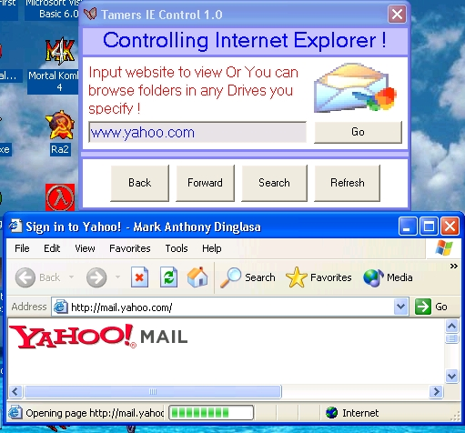



## Controlling IE the Simplest Way \!

### Description

Hi everybody, Ever wonder how to control Internet explorer with visual basic in the easiest way? Heres a code for you...And for the advance users, just make some modifications on my program you can create nice program or addins into your own projects....Have a nice day and Have fun explorering as well. Comments and Sugeestions are welcome. And also don't forget to vote if you like it. Thanks ! A.K.A Tamers
 
### More Info
 

             |
---                |---
**Submitted On**   |2005-09-27 00:20:04
**By**             |[Mark Anthony Dinglasa](https://github.com/Planet-Source-Code/PSCIndex/blob/master/ByAuthor/mark-anthony-dinglasa.md)
**Level**          |Beginner
**User Rating**    |4.3 (13 globes from 3 users)
**Compatibility**  |VB 5\.0, VB 6\.0
**Category**       |[Coding Standards](https://github.com/Planet-Source-Code/PSCIndex/blob/master/ByCategory/coding-standards__1-43.md)
**World**          |[Visual Basic](https://github.com/Planet-Source-Code/PSCIndex/blob/master/ByWorld/visual-basic.md)
**Archive File**   |[Controllin1935799272005\.zip](https://github.com/Planet-Source-Code/mark-anthony-dinglasa-controlling-ie-the-simplest-way__1-62695/archive/master.zip)

